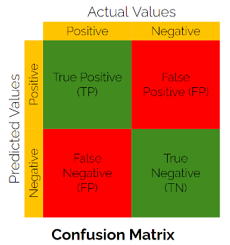
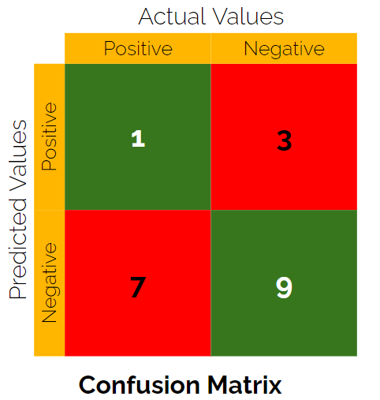
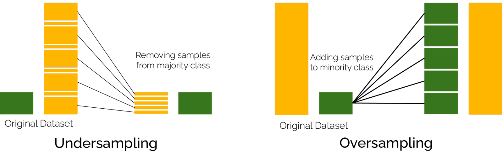
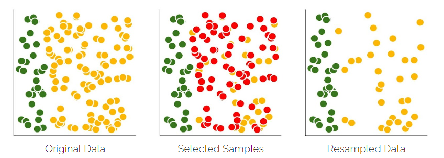
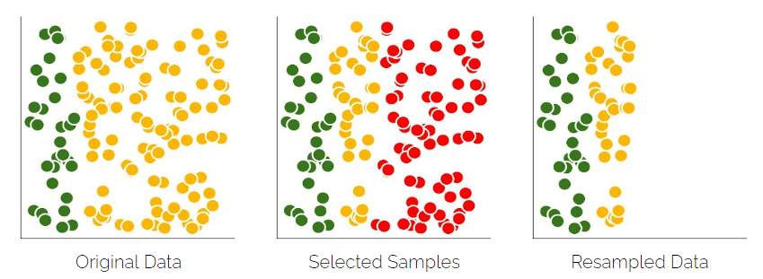
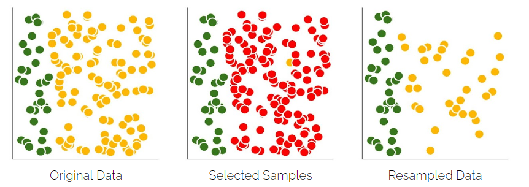
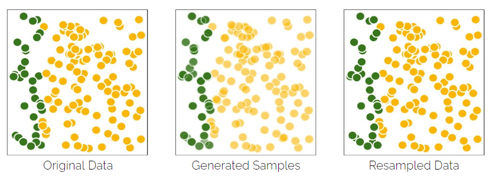
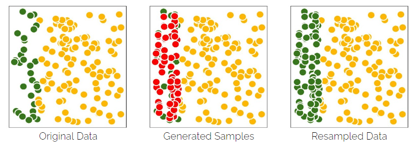
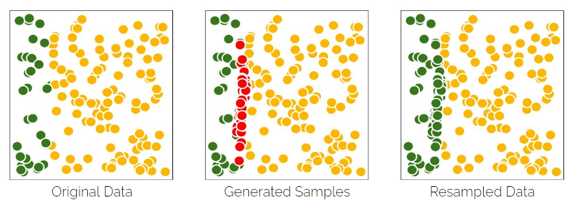
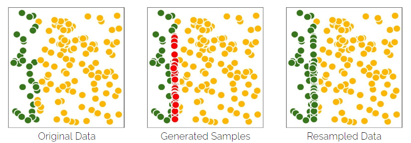

<h1 style="text-align:center">HANDLING IMBALANCED DATA</h1>

A classification data set with skewed class proportions is called **imbalanced**. Classes that make up a large proportion of the data set are called **majority classes**. Those that make up a smaller proportion are **minority classes**.

| Degree of imbalance | Proportion of Minority Class |
| :------------------ | :--------------------------- |
| Mild                | 20-40% of the data set       |
| Moderate            | 1-20% of the data set        |
| Extreme             | <1% of the data set          |

The learning phase and the subsequent prediction of machine learning algorithms can be affected. 

If the dataset is biased towards one class, an algorithm trained on the same data will be biased towards the same class. The model learns more from biased examples as opposed to the examples in the minority class. One might end up with a scenario where a model assumes that any data you feed it belongs to the majority class

# The Myth of Accuracy

There exists a commonly held, if rarely spoken, belief that the usefulness of any predictive model is directly related to its accuracy as measured against the real world. Accuracy seems to be the most intuitive and the most basic evaluation metric to measure how well a trained algorithm performs in real world. The accuracy of a classifier is the total number of correct predictions by the classifier divided by the total number of predictions.

Accuracy measures the entire dataset with no direct regard to the imbalanced distribution and can create an “over-optimistic” interpretation of the classification results. For example, in a two-class problem with a class distribution of 90:10, the accuracy on majority-class examples will count nine times as much as the performance on minority-class examples. In other words, even if the classifier correctly predicts all the majority-class but wrongly for all the minority-class, you will still get a 90% accuracy! 

The myth of accuracy can be visually explained using a **confusion matrix**. A confusion matrix is a specific table layout that allows visualization of the performance of an algorithm, with two dimensions *“actual” and “predicted”)*, and identical sets of “*classes*” in both dimensions. In the classification matrix, a **true positive** is an outcome where the model correctly predicts the positive class. Similarly, a **true negative** is an outcome where the model correctly predicts the negative class. As illustrated in the below example, the model only predicted one value correctly in positive class but still has 81% accuracy.

|  |  |
| ------------------------------------------------------------ | ------------------------------------------------------------ |

Alternative evaluation metrics that take into account other different quadrants of the evaluation matrix to give us a better intuition about the predictive quality of our model. Most common among them are **Precision, Recall** and **F1-Score**

* **Precision** also called ***Positive Predictive Value*** predicts the positive values that are correctly produced from the total values in the positive class.
* **Recall** also called ***sensitivity*** measures the fraction of correctly predicted positive class from the total positive values. **Specificity** on the other hand measures the faction of correctly predicted negative values from the total negative values.   
* **F1-Score**  is the harmonic mean of Precision and Recall with it's value ranging between $0$ and $1$. $1$ indicating perfect precision and recall and $0$ representing no precision and recall.  

$$
\begin{align}
Accuracy (Ac) = \frac{TP+TN}{TP+TN+FP+FN} \\
Precision (P) = \frac{TP}{TP+FP}\\
Recall (R) / Sensitivity = \frac{TP}{TP+FN} \\
Specifity =  \frac{TN}{TN+FP} \\
F1 \textrm{-} Score  = 2 \times \frac{Precision \times Recall}{Precision + Recall} = \frac{2TP}{2TP+FP+FN}\\
\end{align}
$$

In the above confusion matrix, the values of evaluation metrics can be seen as : 
$$
\begin{align}
Accuracy (Ac) = \frac{TP+TN}{TP+TN+FP+FN} = \frac{1+9}{1+9+3+7} = 0.5 \\
Precision (P) = \frac{TP}{TP+FP} = \frac{1}{1+3} = 0.25\\
Recall (R) / Sensitivity = \frac{TP}{TP+FN} = \frac{1}{1+7} = 0.12\\
Specifity =  \frac{TN}{TN+FP} = \frac{9}{9+3}=0.75\\
F1 \textrm{-} Score  = 2 \times \frac{Precision \times Recall}{Precision + Recall} = 2 \times \frac{0.25 \times 0.12}{0.25+0.12} = 0.18\\
\end{align}
$$

# Data Balancing

The machine learning community has addressed the issue of class imbalance in two ways. One to re-sample the original dataset, either by oversampling the minority class and/or under-sampling the majority class and other is to assign distinct costs to training examples. 

## Resampling Techniques

### Under-sampling

Most of the attention of resampling methods for imbalanced classification is put on oversampling the minority class. Nevertheless, a suite of techniques has been developed for under sampling the majority class that can be used in conjunction with effective oversampling methods. The major drawback of random under-sampling is that this method can discard potentially useful data that could be important for the induction process. Therefore under-sampling should be done in such a way that either only redundant examples are deleted or only useful examples for selected. Therefore most under-sampling techniques can be grouped into those that select examples to keep in the transformed dataset (**prototype-selection based techniques**) and those that select examples to delete (**prototype-deletion based techniques**). Several proposed under-sampling techniques exist in literature. Most of them are implemented and ready to use though libraries like `imblearn`. Under-sampling techniques that are presented in this hands-on session are explained below.  

#### Random Under sampling

It is the simplest under-sampling technique and involves randomly selecting examples from the majority class and deleting them from the training dataset. The major drawback of random under-sampling is that this method can discard potentially useful data that could be important for the induction process.

#### Near-Miss

Near Miss refers to a collection of under-sampling methods that select examples based on the distance of majority class examples to minority class examples. NWhen two points belonging to different classes are very close to each other in the distribution, this algorithm eliminates the data-points of the larger class thereby trying to balance the distribution. 

#### Cluster Centroid

This technique generates a new representative set by finding cluster centroids of KMeans algorithm. This algorithm keeps N majority samples by fitting the KMeans algorithm with N cluster to the majority class and using the coordinates of the N cluster centroids as the new majority samples.

### Over Sampling

#### Random Oversampling

Random oversampling involves randomly selecting examples from the minority class, with replacement, and adding them to the training dataset. This technique can be effective for those machine learning algorithms that are affected by a skewed distribution and where multiple duplicate examples for a given class can influence the fit of the model.

#### SMOTE

SMOTE algorithm creates synthetic samples for a given data point (seed) from minority classes, it first randomly selects one of its K-nearest minority neighbors (K is specified by researchers arbitrarily). Then, a random point that is on the line between the seed and the selected neighbor will be synthesized as a new data sample.

#### BorderlineSMOTE

This algorithm starts by classifying the minority class observations. It classifies any minority observation as a noise point if all the neighbors are the majority class and such an observation is ignored while creating synthetic data (Similar to DBSCAN). Further, it classifies a few points as border points that have both majority and minority class as neighborhood and resample completely from these points (Extreme observations on which a support vector will typically pay attention to).

#### AdaSyn

The central idea of boosting is the implementation of homogeneous ML algorithms in a sequential way, where each of these ML algorithms tries to improve the stability of the model by focusing on the errors made by the previous ML algorithm.

## Ensemble Techniques

An ensemble-based method can be used to deal with imbalanced datasets. The belief is that multiple learning methods are more effective than a single one. It’s an approach that combines the performance or results of many classifiers to better the performance of a single classifier.

#### Bagging Techniques

In Bagging techniques base learners (individual ML Models) are trained separately in parallel with a random blanched sub-sample from the training set, which through a voting or averaging approach, produce a more stable and accurate model with lower variance.

#### Boosting Techniques

The central idea of boosting is the implementation of homogeneous ML algorithms in a sequential way, where each of these ML algorithms tries to improve the stability of the model by focusing on the errors made by the previous ML algorithm.
